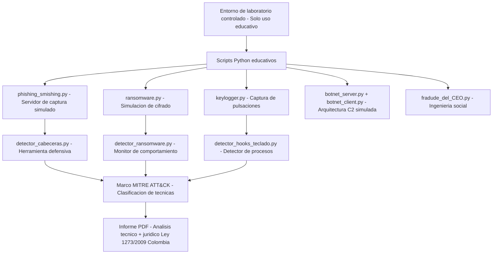

<div align="center">

<pre>
██╗   ██╗███████╗ ██████╗████████╗ ██████╗ ██████╗ ███████╗███████╗
██║   ██║██╔════╝██╔════╝╚══██╔══╝██╔═══██╗██╔══██╗██╔════╝██╔════╝
██║   ██║█████╗  ██║        ██║   ██║   ██║██████╔╝█████╗  ███████╗
╚██╗ ██╔╝██╔══╝  ██║        ██║   ██║   ██║██╔══██╗██╔══╝  ╚════██║
 ╚████╔╝ ███████╗╚██████╗   ██║   ╚██████╔╝██║  ██║███████╗███████║
  ╚═══╝  ╚══════╝ ╚═════╝   ╚═╝    ╚═════╝ ╚═╝  ╚═╝╚══════╝╚══════╝

  ██████╗ ███████╗     █████╗ ████████╗ █████╗  ██████╗ ██╗   ██╗███████╗
  ██╔══██╗██╔════╝    ██╔══██╗╚══██╔══╝██╔══██╗██╔═══██╗██║   ██║██╔════╝
██║  ██║█████╗      ███████║   ██║   ███████║██║   ██║██║   ██║█████╗
██║  ██║██╔══╝      ██╔══██║   ██║   ██╔══██║██║▄▄ ██║██║   ██║██╔══╝
  ██████╔╝███████╗    ██║  ██║   ██║   ██║  ██║╚██████╔╝╚██████╔╝███████╗
  ╚═════╝ ╚══════╝    ╚═╝  ╚═╝   ╚═╝   ╚═╝  ╚═╝ ╚══▀▀═╝  ╚═════╝ ╚══════╝
</pre>

# 🛡️ Vectores de Ataque — Análisis de Ciberseguridad

**Actividad Laboratorio No. 2 · Seguridad en los Sistemas de Información**

[](https://www.unir.net/colombia/)
[](#)
[](https://www.python.org/)
[](#aviso-legal)
[](https://attack.mitre.org/)

</div>

---

## 📋 Tabla de Contenido

- [🎯 Descripción del Proyecto](#-descripción-del-proyecto)
- [⚖️ Aviso Legal](#️-aviso-legal)
- [🗂️ Estructura del Repositorio](#️-estructura-del-repositorio)
- [☠️ Ciberdelitos Analizados](#️-ciberdelitos-analizados)
- [🚀 Cómo Ejecutar los Scripts](#-cómo-ejecutar-los-scripts)
- [🔐 Marco Legal — Colombia](#-marco-legal--colombia)
- [📚 Bibliografía](#-bibliografía)
- [👨‍💻 Autor](#-autor)

---

## 🎯 Descripción del Proyecto

> *"El conocimiento profundo de los mecanismos de ataque no constituye una amenaza en sí mismo, sino una herramienta imprescindible para el fortalecimiento de la cultura de ciberseguridad."*

Este repositorio contiene el desarrollo completo de la **Actividad Laboratorio No. 2** de la asignatura **Seguridad en los Sistemas de Información**, en la cual se documentan y analizan técnicamente cinco de los ciberdelitos más relevantes en el panorama actual de la ciberseguridad.

El trabajo combina **análisis teórico**, **vectores de ataque paso a paso**, **ejemplos de código educativo** y **mecanismos de defensa**, con el objetivo de comprender cómo operan estas amenazas para poder prevenirlas eficazmente.

### 🔍 ¿Qué encontrarás aquí?

| Componente | Descripción |
|------------|-------------|
| 📄 **Documento PDF** | Informe completo con análisis técnico y jurídico |
| 🐍 **Scripts Python** | Código educativo comentado para cada ciberdelito |
| 🛡️ **Herramientas defensivas** | Scripts de detección y análisis |
| 📊 **Mapeo MITRE ATT&CK** | Clasificación con el framework internacional |

---

## ⚖️ Aviso Legal

> [!CAUTION]
> **TODO el código incluido en este repositorio tiene únicamente fines educativos y de análisis académico.**
>
> Su uso con intenciones maliciosas es **ilegal y punible** según la **Ley 1273 de 2009** del Código Penal Colombiano (Ley 599 de 2000). Las conductas tipificadas pueden acarrear penas de prisión entre **48 y 120 meses**, además de multas económicas significativas.
>
> Los scripts están diseñados para ser ejecutados **únicamente en entornos de laboratorio controlados o sandbox**. Nunca en sistemas de terceros sin autorización expresa.

---

## 🗂️ Estructura del Repositorio

```
Vectores_Ataque_Ciberseguridad/
│
├── 📄 README.md                          ← Estás aquí
├── 📋 Informe_Actividad2_AlejandroMendoza.pdf
│
├── 🐍 scripts/
│   ├── 01_phishing_smishing/
│   │   ├── phishing_smishing.py          ← Servidor captura (educativo)
│   │   └── detector_cabeceras.py         ← Herramienta defensiva
│   │
│   ├── 02_ransomware/
│   │   ├── ransomware.py                 ← Simulación cifrado (educativo)
│   │   └── detector_ransomware.py        ← Monitor de comportamiento
│   │
│   ├── 03_keylogger/
│   │   ├── keylogger.py                  ← Captura pulsaciones (educativo)
│   │   └── detector_hooks_teclado.py     ← Detector de procesos
│   │
│   ├── 04_botnet/
│   │   ├── botnet_server.py              ← Servidor C2 (educativo)
│   │   └── botnet_client.py              ← Cliente bot (educativo)
│   │
│   └── 05_fraude_ceo/
│       ├── fraude_ceo.py                 ← OSINT organizativo (educativo)
│       └── verificador_spf_dmarc.py      ← Herramienta defensiva
│
└── 📦 requirements.txt                   ← Dependencias Python
```

---

## ☠️ Ciberdelitos Analizados

<table>
<thead>
<tr>
<th>#</th>
<th>Ciberdelito</th>
<th>Vector Principal</th>
<th>Complejidad</th>
<th>MITRE ATT&CK</th>
</tr>
</thead>
<tbody>
<tr>
<td>

**`01`**

</td>
<td>

### 🎣 Phishing / Smishing

</td>
<td>Ingeniería social mediante correo o SMS fraudulento</td>
<td>


</td>
<td>

[T1566](https://attack.mitre.org/techniques/T1566/)

</td>
</tr>
<tr>
<td>

**`02`**

</td>
<td>

### 🔒 Ransomware

</td>
<td>Email malicioso + cifrado AES-256/RSA-2048 de archivos</td>
<td>


</td>
<td>

[T1486](https://attack.mitre.org/techniques/T1486/)

</td>
</tr>
<tr>
<td>

**`03`**

</td>
<td>

### ⌨️ Keylogger

</td>
<td>Software oculto que intercepta pulsaciones de teclado</td>
<td>


</td>
<td>

[T1056](https://attack.mitre.org/techniques/T1056/)

</td>
</tr>
<tr>
<td>

**`04`**

</td>
<td>

### 🤖 Botnet

</td>
<td>Malware con comunicación C2 — red de equipos zombi</td>
<td>


</td>
<td>

[T1071](https://attack.mitre.org/techniques/T1071/)

</td>
</tr>
<tr>
<td>

**`05`**

</td>
<td>

### 🕴️ Fraude del CEO (BEC)

</td>
<td>Suplantación de identidad + manipulación psicológica</td>
<td>

_Alto_(estratégico)-red?style=flat-square)

</td>
<td>

[T1656](https://attack.mitre.org/techniques/T1656/)

</td>
</tr>
</tbody>
</table>

---

### 🎣 01 · Phishing / Smishing

**¿Qué es?** Técnica de ingeniería social que suplanta entidades de confianza para robar credenciales. El smishing usa SMS como vector.

**Vector de ataque:**
```
Reconocimiento (OSINT) → Clonar sitio web → Envío masivo → Captura credenciales → Explotación
```

**Archivos:**
- `phishing_smishing.py` → Servidor Flask que simula captura de credenciales
- `detector_cabeceras.py` → Análisis defensivo de cabeceras SPF/DKIM/DMARC

---

### 🔒 02 · Ransomware

**¿Qué es?** Malware que cifra archivos con AES-256 + RSA-2048 y exige rescate en criptomonedas. Casos: WannaCry, REvil, LockBit.

**Vector de ataque:**
```
Phishing inicial → Persistencia (registro Windows) → Movimiento lateral → Cifrado masivo → Rescate
```

**Archivos:**
- `ransomware.py` → Simulación del mecanismo de cifrado híbrido
- `detector_ransomware.py` → Monitor de comportamiento con watchdog

> [!WARNING]
> El script `ransomware.py` **SOLO debe ejecutarse en una carpeta de sandbox aislada**. Nunca en directorios con archivos reales.

---

### ⌨️ 03 · Keylogger

**¿Qué es?** Software que registra en secreto todas las pulsaciones de teclado y las exfiltra periódicamente al atacante.

**Vector de ataque:**
```
Distribución (adjunto malicioso / software pirata) → Instalación oculta → Hook WinAPI → Exfiltración SMTP
```

**Archivos:**
- `keylogger.py` → Captura de pulsaciones con pynput + exfiltración simulada
- `detector_hooks_teclado.py` → Detección de procesos y DLLs sospechosas

---

### 🤖 04 · Botnet

**¿Qué es?** Red de equipos zombi controlados por servidor C2. Usada para DDoS, spam, cryptojacking. Caso Mirai: 600.000+ dispositivos IoT.

**Vector de ataque:**
```
Infección masiva (IoT / malware) → Comunicación C2 (beaconing) → Ejecución órdenes → Mantenimiento red
```

**Archivos:**
- `botnet_server.py` → Servidor C2 con Flask (registro de bots, cola de comandos)
- `botnet_client.py` → Cliente bot con check-in periódico

---

### 🕴️ 05 · Fraude del CEO (BEC)

**¿Qué es?** Suplantación del CEO para ordenar transferencias fraudulentas. Sin malware, puro engaño psicológico. El FBI reportó $2.900M en pérdidas en 2023.

**Vector de ataque:**
```
OSINT profundo (semanas) → Suplantación email → Urgencia + confidencialidad → Transferencia → Lavado
```

**Archivos:**
- `fraude_ceo.py` → Recopilación de estructura organizativa pública (OSINT)
- `verificador_spf_dmarc.py` → Verificación de autenticación de dominios

---

## 🚀 Cómo Ejecutar los Scripts

### Prerequisitos

```powershell
# Verificar versión de Python (requiere 3.10+)
python --version

# Instalar dependencias
pip install -r requirements.txt
```

### Dependencias (`requirements.txt`)

```
flask>=3.0.0
cryptography>=42.0.0
pynput>=1.7.6
requests>=2.31.0
psutil>=5.9.0
watchdog>=4.0.0
dnspython>=2.6.0
beautifulsoup4>=4.12.0
```

### Ejecución por módulo

```powershell
# ── 01 Phishing (detector defensivo) ──
python scripts/01_phishing_smishing/detector_cabeceras.py

# ── 02 Ransomware (SOLO EN SANDBOX) ──
python scripts/02_ransomware/detector_ransomware.py

# ── 03 Keylogger (detector defensivo) ──
python scripts/03_keylogger/detector_hooks_teclado.py

# ── 04 Botnet — levantar servidor C2 local ──
python scripts/04_botnet/botnet_server.py

# ── 05 Fraude CEO — verificador SPF/DMARC ──
python scripts/05_fraude_ceo/verificador_spf_dmarc.py
```

---

## 🔐 Marco Legal — Colombia

Todo el contenido de este repositorio se enmarca dentro del ordenamiento jurídico colombiano:

| Ley | Artículo | Conducta |
|-----|----------|----------|
| Ley 1273/2009 | Art. 269A | Acceso abusivo a sistema informático |
| Ley 1273/2009 | Art. 269B | Obstaculización ilegítima de sistemas |
| Ley 1273/2009 | Art. 269C | Interceptación de datos informáticos |
| Ley 1273/2009 | Art. 269D | Daño informático |
| Ley 1273/2009 | Art. 269F | Violación de datos personales |
| Ley 1273/2009 | Art. 269G | Suplantación de sitios web |
| Ley 1273/2009 | Art. 269H | Transferencia no consentida de activos |
| Ley 1273/2009 | Art. 269I | Hurto por medios informáticos |
| Ley 599/2000  | Art. 246  | Estafa |

> Para reportar incidentes: **Centro Cibernético Policial** → [caivirtual.policia.gov.co](https://caivirtual.policia.gov.co) · Línea: **📞 017**

---

## 📚 Bibliografía

- 🔴 [MITRE ATT&CK Framework](https://attack.mitre.org) — Clasificación de tácticas y técnicas adversarias
- 🔵 [ENISA Threat Landscape 2023](https://www.enisa.europa.eu) — Panorama europeo de amenazas
- 🟡 [FBI IC3 Internet Crime Report 2023](https://www.ic3.gov) — Estadísticas de cibercrimen
- 🟢 [NIST Cybersecurity Framework](https://www.nist.gov/cyberframework) — Marco de ciberseguridad
- 🟠 [CrowdStrike Global Threat Report 2023](https://www.crowdstrike.com) — Inteligencia de amenazas
- 🔵 [Centro Cibernético Policial Colombia](https://caivirtual.policia.gov.co) — Cibercriminalidad en Colombia
- ⚫ [Ley 1273 de 2009](https://www.funcionpublica.gov.co/eva/gestornormativo/norma.php?i=34492) — Código Penal Colombiano — Delitos informáticos
- 📘 Material académico — Seguridad en los Sistemas de Información — UNIR Colombia — Ing. Diego Osorio Reina

---

## 👨‍💻 Autor

<div align="center">


### Alejandro De Mendoza

[](https://github.com/AlejoTechEngineer)

**Ingeniería Informática**  
Fundación Universitaria Internacional de la Rioja · Bogotá D.C.  
Febrero 2026

*Presentado al profesor: **Ing. Diego Osorio Reina***

</div>

---

<div align="center">

**⭐ Si este trabajo te fue útil, dale una estrella al repo ⭐**

*"Comprender cómo operan las amenazas permite anticiparlas, mitigarlas y fortalecer la cultura de ciberseguridad."*


</div>
## Arquitectura


